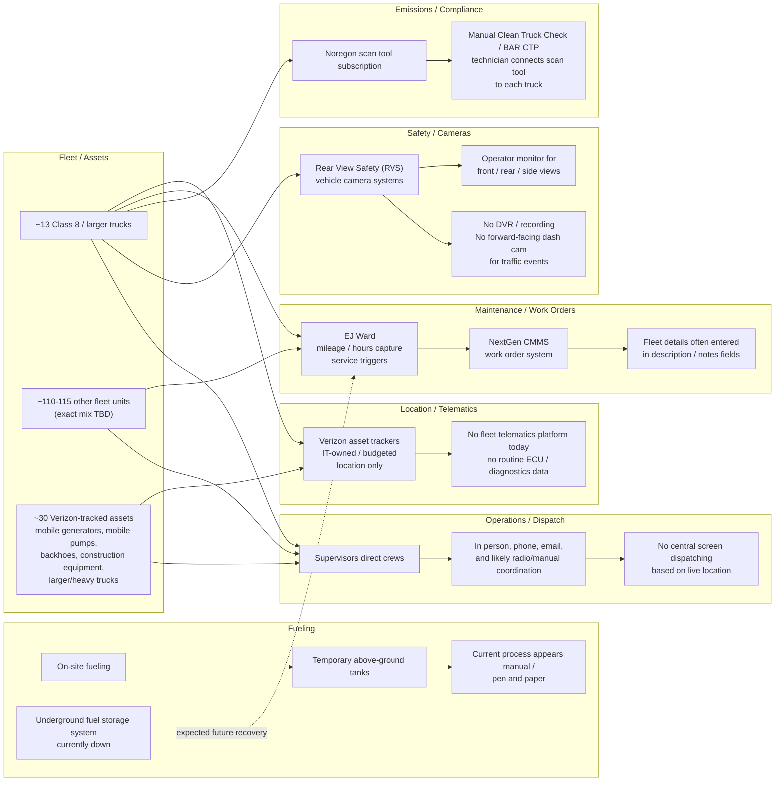

# Moulton-Niguel Water District - Current Tech Stack Canvas

Source: Samsara discovery call recorded Jun 24, 2026.

Purpose: rough, editable canvas for a customer working session. Use this to validate what is live today, what is down or manual, and where Samsara may connect or replace workflows.

## 1. Simple current-state canvas

## 2. Tech stack inventory

| Area | Current tool / process | What it does today | Status / gaps | Validate with customer |
| --- | --- | --- | --- | --- |
| Asset location | Verizon asset trackers | Tracks location/position for heavy trucks and larger/mobile assets | Not used for telematics; no clear ECU/diagnostics data; inherited from IT | Which Verizon product? Which devices are plug-in vs asset tags? Who owns admin access and data export? |
| Fleet telematics | None stated | No fleet-oriented telematics platform today | Dispatch and fleet visibility are manual; no live fleet operations screen | Any vehicles already have OEM telematics? Any AVL/GPS in other departments? |
| Maintenance triggers | EJ Ward | Tracks vehicle mileage and hours; triggers service around ~4,000 miles or ~250 heavy-duty hours | Used for triggers, but broader workflow is split with NextGen | Confirm trigger thresholds by class and whether EJ Ward receives data automatically today |
| Work orders / CMMS | NextGen CMMS | Builds and manages work orders | Not designed for fleet; fleet-specific details go into free-text notes/description fields | Confirm whether this is "NexGen" CMMS spelling/vendor and whether it must remain the system of record |
| Fueling | On-site fueling; temporary above-ground tanks | Fueling is currently handled on site | Underground fuel system has been down for ~2 years; EJ Ward fueling is effectively down; current tracking appears manual/paper | What data is captured today: gallons, odometer, unit, driver, date/time? Expected underground system return timing and vendor scope? |
| Fueling system | EJ Ward | Historically tied to underground fuel storage / fueling process | Not active for current temporary tank setup | Will EJ Ward resume when underground system returns? Any interim export available? |
| Emissions / clean truck | Noregon scan tool subscription | Manual Clean Truck Check / BAR CTP process | Technician must physically connect scan tool to each truck; subscription add-on roughly ~$1,000/year on top of base cost | Exact annual cost, number of compliant vehicles, reporting cadence, and who submits results |
| Vehicle camera visibility | Rear View Safety (RVS) | Vehicle-mounted cameras help operators see front/rear/sides through in-cab monitor | No DVR/recording; no standalone dash cam watching traffic; limited accident evidence | Which vehicles have RVS? Can current RVS cameras integrate with DVR or must they be replaced/augmented? |
| Safety event evidence | CHP / accident reports | Accident context comes from external reports | Little/no first-party video evidence today | Any claims, risk, or union/privacy requirements for driver-facing or road-facing video? |
| Dispatch / daily operations | Supervisor-led manual coordination | Supervisors direct staff by department using in-person direction, phone, email, etc. | No centralized real-time dispatch workflow | Is real-time dispatch a target outcome or mainly visibility/compliance/maintenance? |

## 3. Key numbers captured

| Metric | Current understanding | Confidence / note |
| --- | --- | --- |
| Class 8 / larger trucks | About 13 | Stated by Bryan |
| Other fleet units | About 110-115 | Exact vehicle mix unclear due transcript artifact |
| Verizon-tracked units | About 30 | Stated by Matt |
| Maintenance interval | About 4,000 miles or 250 hours for heavier duty | Validate by asset class |
| Noregon clean truck add-on | Roughly ~$1,000/year | Bryan did not recall exact amount |
| Fuel system downtime | Underground fuel system down about 2 years | Legal matter; hoped back within about a year, uncertain |

## 4. Current pain points / friction

- Verizon location tracking is not fleet-owned and does not appear to provide telematics/ECU data.
- Fleet maintenance work orders live in a general CMMS, so fleet-specific fields become notes instead of structured data.
- Clean Truck Check / BAR CTP process is manual and consumes technician time.
- Noregon compliance capability carries an additional subscription cost.
- Fueling is temporarily manual because the underground fuel system and EJ Ward fueling workflow are down.
- Camera systems help operators maneuver but do not provide recorded traffic/event evidence.
- Day-to-day routing and coordination are supervisor-driven rather than based on a live fleet operations view.

## 5. Potential Samsara value areas to explore

| Opportunity | Why it matters for Moulton-Niguel | Integration / replacement question |
| --- | --- | --- |
| Fleet telematics for vehicles | Add live location, mileage, hours, diagnostics, fault data, utilization, and service automation | Feed Samsara data into EJ Ward, NextGen, or both? |
| Heavy equipment / asset gateways | Extend beyond simple location for generators, pumps, backhoes, and heavy assets where ECU data is available | Which assets support engine/ECU connectivity? |
| Automated Clean Truck Check / BAR CTP | Reduce technician manual scan time and potentially reduce Noregon add-on dependency | Confirm Samsara-supported vehicles and reporting workflow |
| Maintenance workflow improvements | Replace free-text fleet notes with structured fleet data and automated service triggers | Decide whether NextGen remains work order system of record |
| Safety cameras / event video | Add recorded road-facing evidence and event review | Determine privacy stance, DVR needs, and compatibility with current RVS coverage |
| Fuel data normalization | Bridge current manual fuel process and future EJ Ward restoration | Determine near-term manual import vs future automated integration |

## 6. Workshop questions to add/edit live

1. What systems are mandatory systems of record?
   - Work orders:
   - Fuel:
   - Compliance:
   - Asset inventory:
2. Which departments own each platform?
   - IT:
   - Fleet:
   - Operations:
   - Compliance:
3. What does success look like for the first phase?
   - Compliance automation:
   - Maintenance automation:
   - Live asset visibility:
   - Safety video:
   - Fuel tracking:
4. What data needs to flow between systems?
   - Samsara -> NextGen:
   - Samsara -> EJ Ward:
   - EJ Ward -> NextGen:
   - Manual import/export:
5. Which assets should be in scope?
   - Class 8 trucks:
   - Light/medium fleet:
   - Mobile generators:
   - Mobile pumps:
   - Construction equipment:
   - Other:

## 7. Editable blank canvas

Use this section during the customer session.

| Layer | Current state | Pain / gap | Desired future state | Owner | Notes |
| --- | --- | --- | --- | --- | --- |
| Assets / inventory |  |  |  |  |  |
| Location / telematics |  |  |  |  |  |
| Maintenance |  |  |  |  |  |
| Work orders / CMMS |  |  |  |  |  |
| Fuel |  |  |  |  |  |
| Emissions / compliance |  |  |  |  |  |
| Cameras / safety |  |  |  |  |  |
| Dispatch / operations |  |  |  |  |  |
| Integrations / data |  |  |  |  |  |
